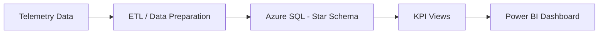
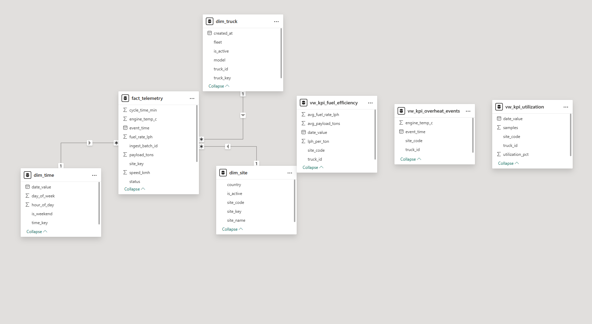
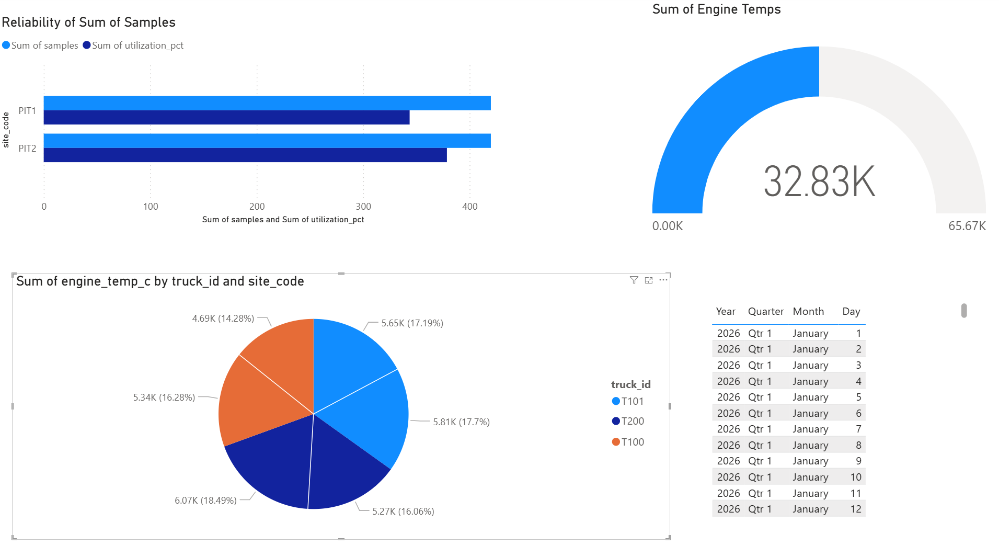
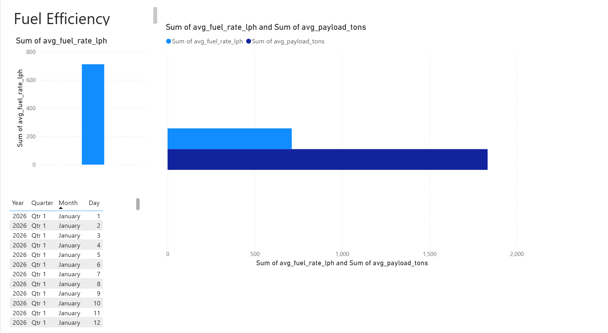
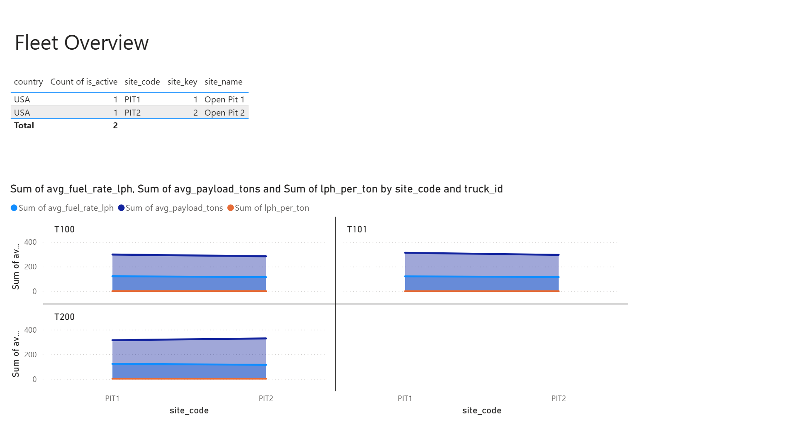
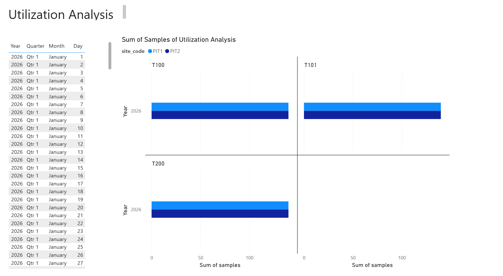

# ⛏️ Mining Telemetry Analytics Platform (Azure SQL · Power BI · Python)

End-to-end sample analytics solution that transforms raw mining telemetry into **production-ready KPIs** using a dimensional model.

Designed to demonstrate how operational data becomes **actionable insights** in a cloud analytics environment aligned with **Komatsu Modular – Digital Services**.

---

## Solution

This solution implements:

- Dimensional model (star schema)
- KPI semantic layer
- Analytical queries optimized for reporting
- Interactive dashboard


## Architecture


## Data Model

### Fact Table
- fact_telemetry → telemetry measurements

### Dimension Tables
- dim_truck → equipment
- dim_site → mining site
- dim_time → time intelligence

Grain: one telemetry record per truck per timestamp.

---

## KPIs

- Utilization %
- Fuel efficiency (L / ton)
- Overheat events
- Overheat rate

## Repository Structure

```mermaid
flowchart LR
    A[Data Sources] --> B[data-ingestion]

    B --> C[(Database<br/>Raw)]

    C --> D[ETL / Transformations]

    D --> E[(Database<br/>Curated)]

    E --> F[API]

    F --> G[Dashboard]


komatsu-digital-analytics-sample/
│
├── data-ingestion/      # Raw telemetry simulation or ingestion scripts
├── etl/                 # Transformations and data loading into Azure SQL
├── database/            # Tables, star schema, KPI views
├── api/                 # Optional REST API to expose KPIs
├── dashboard/           # Power BI or Streamlit app
├── infrastructure/      # IaC / deployment scripts (conceptual)
└── README.md

## Technology Stack

- Azure SQL Database
- T-SQL
- DAX
- Power BI
- Python (optional for dashboard)

## How to Run

1. Deploy the database schema from /sql
2. Load sample data
3. Open the Power BI file
4. Refresh the model

## Example Analytical Questions

- Which trucks have the lowest utilization?
- Which site has the highest fuel consumption per ton?
- How many overheat events occurred this month?

## Dashboard Preview

### Data Model


### Overheat - Reliability Page


### Fuel Efficiency Page


### Overview Page


### Utilization Page


## Business Impact

This architecture enables:

- Fleet performance monitoring
- Early anomaly detection
- Data-driven operational decisions

## Author

Alicia Espinoza  
Software Engineer – Data & Cloud Analytics  
Tucson, AZ
