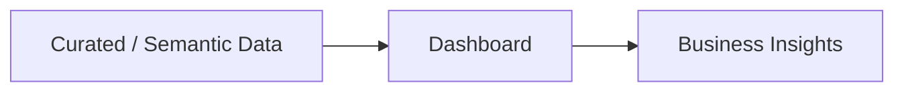

#  Dashboard

This module contains the analytics dashboards that deliver operational insights from the curated data layer.

It is the consumption layer of the platform, where trusted and modeled data is transformed into interactive and actionable visualizations for business users.

---

## Purpose

The dashboard enables:

- Monitoring of key operational KPIs
- Identification of performance trends
- Data-driven decision-making

It connects to the semantic / curated layer to ensure consistency, performance, and a single source of truth.

---

## Data Flow

---

## Personal Note

The dashboard is where the entire data platform delivers value, so I focus on connecting it to a trusted semantic layer to guarantee consistency, performance, and a single source of truth.
